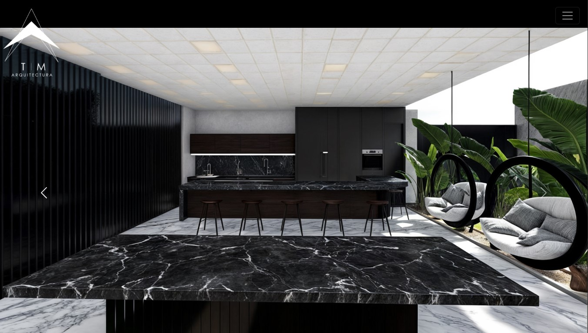
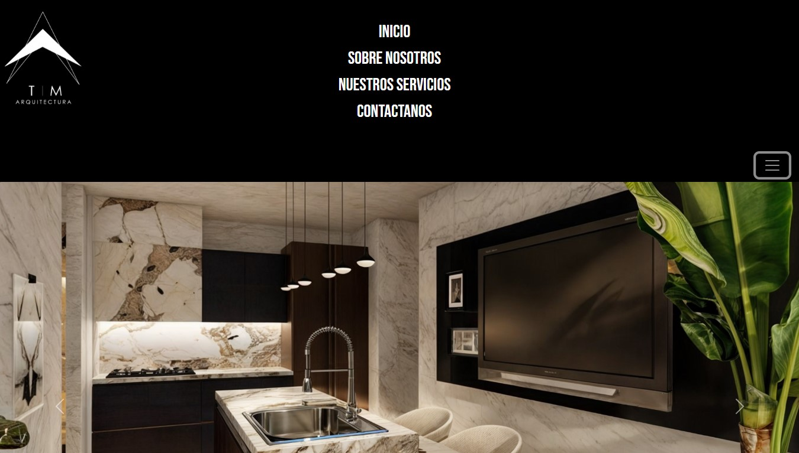
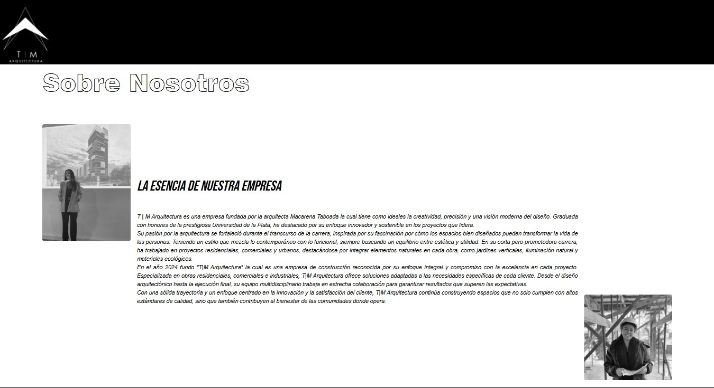

# Pagina Web de Arquitectura - Proyecto personal (En proceso).

  

**TM Arquitectura** es una página web en proceso, diseñada para una arquitecta, la cual busca tener un espacio en internet al que sus potenciales clientes puedan acceder. Dicha página esta siendo creada con React y Vite, acompañado de TypeScript, CSS y Bootstrap. 

## Vista previa

  
   
  
   
  
   

